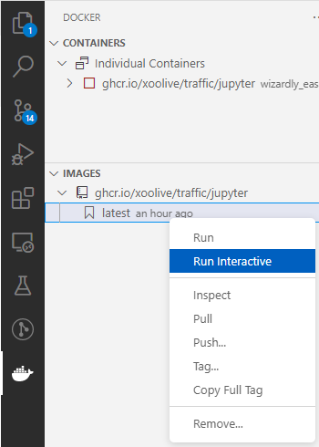
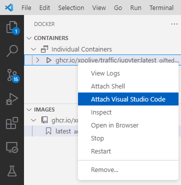

How to use traffic in a Docker container?
=========================================

If you don't want to be bothered with Python's dependencies and just want to
work, using a Docker container might be an easy solution. It is quite simple to
run the traffic library with everything it needs in a Docker container, and you
have a few options. We provide a self-contained container image on GitHub that
you can use. It has everything in it that you need. Or, alternatively, you can
build your own image. We describe both below.

Use the self-contained container image provided by GitHub
------------------------------

Using the container image from GitHub is simple. Just make sure you have Docker
installed and running, then pull the image with:

.. code:: bash

    docker pull ghcr.io/xoolive/traffic/jupyter:latest -p 8888:8888

Once the image is downloaded, you can run it with

.. code:: bash

    docker run -it -p 8888:8888 ghcr.io/xoolive/traffic/jupyter

This will start the container with port 8888 of the container being mapped to port 8888 of the host machine. You can connect to it with the browser and work in a Jupyter notebook. Just copy-paste the URL that starts with *http://127.0.0.1:8888...* into your favorite browser and have fun.

Use the self-contained container image provided by GitHub with Visual Studio Code.
------------------------------------------------------

Using Visual Studio Code (VS Code) makes the process even more convenient. You just need to make sure
that you have the *Docker* and *Remote - Containers* extensions installed.

If you have some code that you'd like to run in the container, follow these instructions:
1. Pull the image from GitHub as above.
2. Open the *Extensions* view in VS Code by clicking on the Extensions icon in the Activity Bar on the side of the window.

This will show give you the URL that you can use on the console similar to the
example above. The much cooler thing is, if you have the container running (as
you now do if you followed the instructions) you can change VS Code to be
running as if it was *in* the container. For that, you can right-click on the
container and select *Attach Visual Studio Code*.

This will start a new instance of VS Code running within the container, allowing you to use all the features of VS Code, including Jupyter notebooks.

Create your own Dockerfile
--------------------------

In case you feel a bit more adventurous, you can also create your own
Dockerfile and use it for your container. The following two examples show how
you can use the traffic library in a Docker with `Jupyter notebook
<https://jupyter-docker-stacks.readthedocs.io/en/latest/>`__.  If you are
completely unfamiliar with Docker and how to modify a Docker image, you can
find a good tutorial in the `official documentation
<https://docs.docker.com/get-started/>`__. Of course, you can base your Docker
container on a different Dockerfile as the one used in the examples.

In the simplest case when you just want to run the traffic library in a Docker
container, you can install the library and its dependencies directly into the
base environment of the container. In that case, the ``Dockerfile`` could look
like the following:

.. code:: dockerfile

    FROM jupyter/minimal-notebook

    USER jovyan
    RUN mamba install -c conda-forge traffic

    # Set the environment variable for PROJ to avoid issues with the conda base environment
    ENV PROJ_LIB=/opt/conda/share/proj

Note the last line, which sets an environment variable for PROJ. This is needed
because the conda base environment never gets properly activated and this fixes
the issue described `here
<https://gis.stackexchange.com/questions/364421/how-to-make-proj-work-via-anaconda-in-google-colab>`__.
To run this Docker, you first have to generate an image with ``docker build``:

.. code:: bash

    docker build -f jupyter.Dockerfile -t traffic/jupyter:latest .

The Docker container can now be started:

.. code:: bash

    docker run -it -p 8888:8888 traffic/jupyter:latest

Run Jupyter in a custom environment
-----------------------------------

If you have already a working conda environment that you would like to use, you
can install your existing environment into the Docker container.

The ``Dockerfile`` could look like the following:

.. code:: dockerfile

    FROM conda/minimal-notebook:4.10

    COPY environment.yml environment.yml
    COPY traffic.yml traffic.yml

    # install nb_conda into the base python to allow the user to choose the
    # environment in the jupyter notebook and install environment
    USER jovyan
    RUN mamba install -y nb_conda
    RUN mamba env create -f traffic.yml

Note that the environment file ``traffic.yml`` has to be in the same directory
as the ``Dockerfile``: a sample version is provided in the ``docker`` folder.
